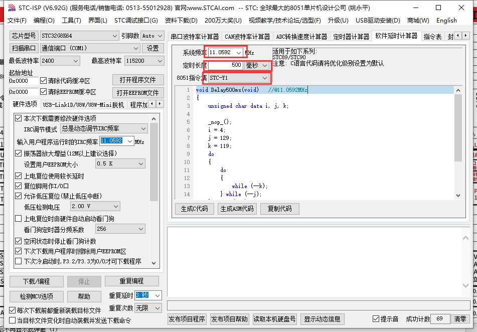

## 01_LED实验

这个实验主要测试并说明51单片机控制GPIO的输出，89C51系列单片机有4个GPIO组，P0、P1、P2、P3，每个组有两种控制GPIO输出的方式

一种是使用sbit位操作后控制输出位

```C
sbit LED = P2^0;
LED = 0;
LED = 1;
```

示例中这种方式就可以控制，P2的0号端口进行高低电平的输出。

第二种方式是同时控制8个引脚的输出。

```C
P2 = 0XAA;
P2 = 0X55;
```

这种控制方式就可以将P2的8个位，按照指定的电平格式输出。比如0x55就是让P2的P2.7到P2.0的8位按照01010101（0x55）的格式输出。

实验中的Delay500ms这个函数不用在意，是使用STCISP的软件生成的，他的本质方法是使用一些无用的指令达到延时的作用。

使用方法如图



选择系统频率，想要定时的长度，和STC-Y1也就是89C51系列。然后就会生成相应的代码。该代码使用的时候中间会有`_nop_()`这个函数，他需要包含`intrins.h`这个头文件才能使用。