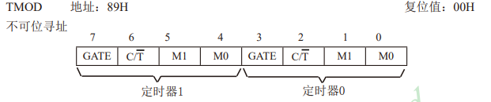
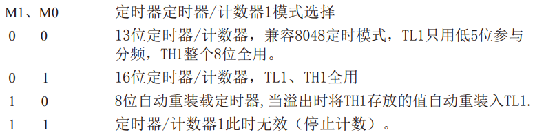

## 04_定时器中断实验

### 定时器中断基础

就和前面的外部中断一样，定时器中断，就是提前给的条件为一个固定的时间，每当这个时间一到，他就会进入一次定时器中断。

我们常在代码中，让他来完成一些需要周期执行的任务，或者计数。

### 定时器中断配置

一般顺序就是如下，这是定时器0的模式配置。

TMOD是模式配置寄存器，高4位是定时器1，低4位是控制定时器0



一般只需要考虑M1和M0，他会有四种工作模式，具体的模式可以看手册



一般定时器常用模式为16位定时器，8位自动重装载一般是串口使用。

TL0和TH0是控制定时器的时间，定时的时间的计算为65535-（TH0x256+TL0)  us

TF0是定时器溢出标志，计数到了最大值该位就会置1

TR0是控制定时器开始计数

ET0是打开定时器的中断，当TF0等于1的时候就会进入中断服务函数。

EA就是是否打开全部中断。

```c
TMOD &= 0xF0;			//设置定时器模式
TMOD |= 0x01;			//设置定时器模式
TL0 = 0x00;				//设置定时初始值
TH0 = 0xEE;				//设置定时初始值
TF0 = 0;				//清除TF0标志
TR0 = 1;				//定时器0开始计时
ET0 = 1;                //打开定时器中断
EA = 1;                 //打开所有中断
```

定时器到了计数的时间就会进入中断服务函数，1是定时器0的中断号，3是定时器1的中断服务号。定时器进了中断服务函数就，计数值会清零，所以我们要给他重新赋值，下一次进入才会是同样定时的时间。我这里定时的是10ms，然后进入中断100次后LED翻转，就是1000ms翻转一次，就是1s。

```C
void Timer0Routine(void) interrupt 1
{
	static int count = 0;
	TL0 = 0x00;				//设置定时初始值
	TH0 = 0xEE;				//设置定时初始值
	count++;
	if(count>100)
	{
		LED = !LED;
		count = 0;
	}
}
```

定时器时间计算可以使用ISP，比较方便


