## 项目说明
这个项目文件是使用Proteus8.9仿真51单片机的一些实例。

使用的软件Proteus8.9：

链接：https://pan.baidu.com/s/1kkgFmRBlh268m_ESl83weg 
提取码：9bde 

## 目前测试通过案例

### 01_LED实验

使用8个LED仿真，可实现单独控制，也可实现同时控制

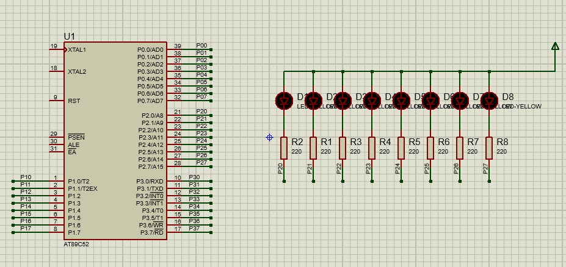

### 02_独立按键输入实验

可以通过按键控制LED的亮灭方式 ，有实现按键单次扫描和多次扫描。

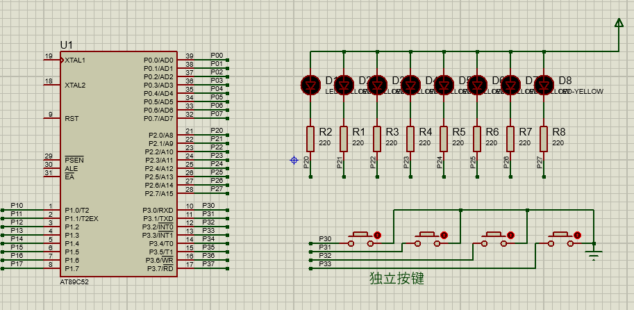   

### 03_外部中断实验

使用按键实现外部中断的检测

  

### 04_定时器中断实验   

使用定时器控制LED的亮灭，使用定时器控制时间间隔

     

### 05_串口中断实验    

可以使用仿真的端口输出打印信息，也可以用虚拟串口的方式实现，虚拟串口安装包有提供

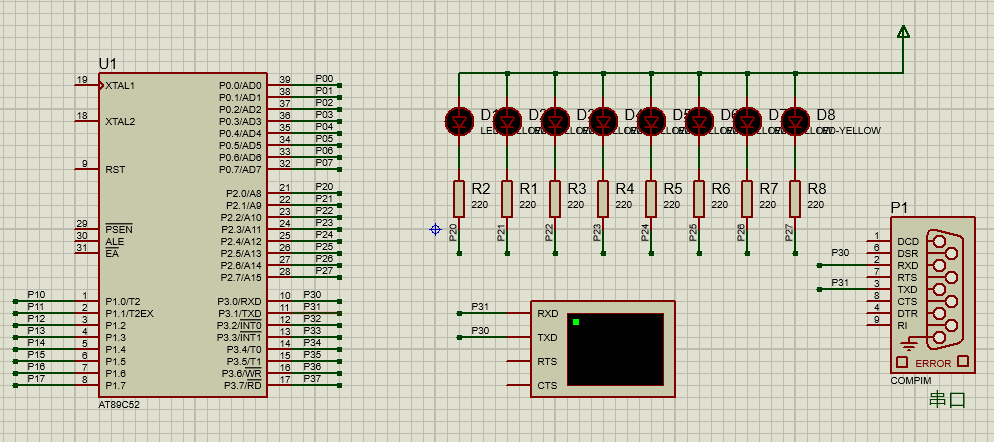         

### 06_数码管显示实验

使用74HC138控制位选，74HC573控制段选，控制这个8位的共阴极数码管

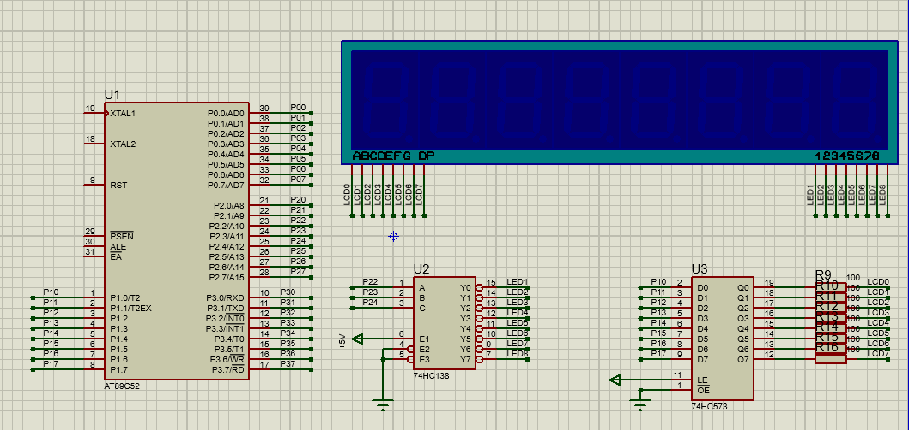         

### 07_LCD1602显示实验

一个LCD1602的驱动程序

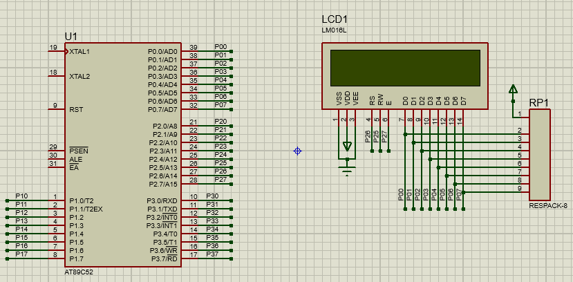

### 08_步进电机控制实验    

5相4线步进电机控制实验

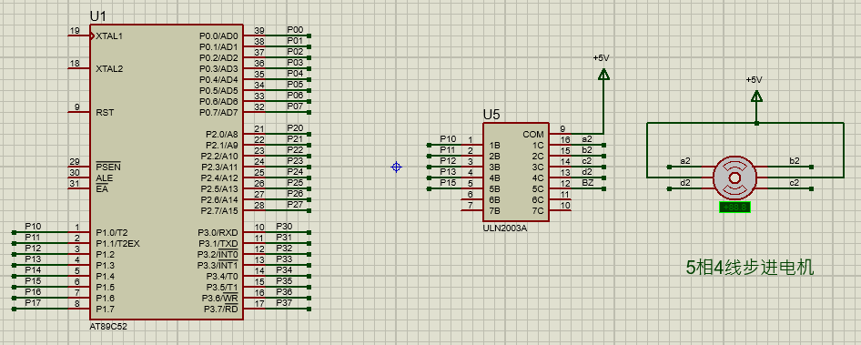

### 09_矩阵键盘输入实验

读取矩阵按键的数据，然后控制LED进行相应的控制     

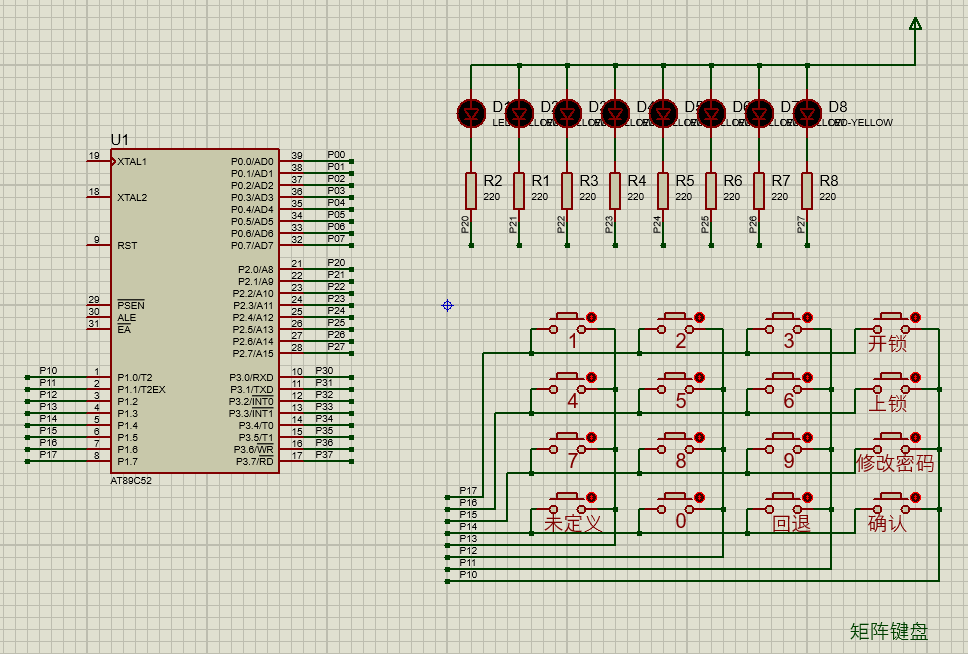

### 10_DS1302实验   

数码管就是前面的实验，按键也是，主要是DS1302的读取和写入实验

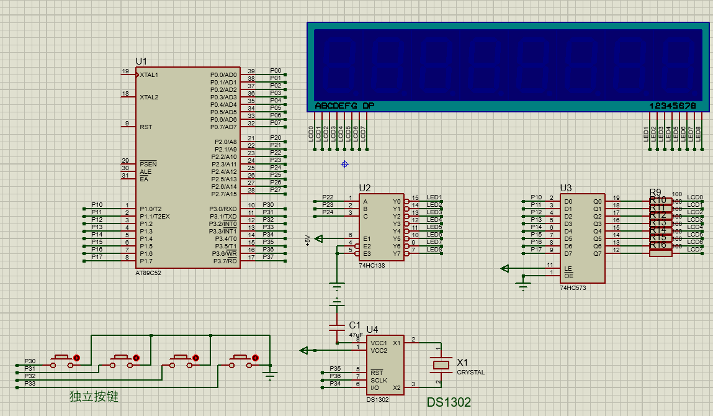

### 11_超声波测距实验

超声波距离可有串口终端查看，可以由示波器查看波形，但是计算不太准确按照实际的计算，不知道为什么。

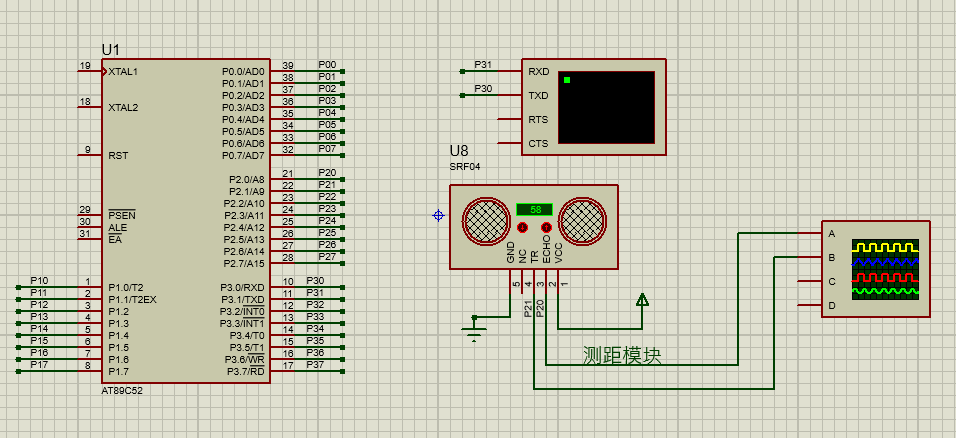

### 12_DS18B20温度检测模块

DS18B20读取并解析后，使用串口打印

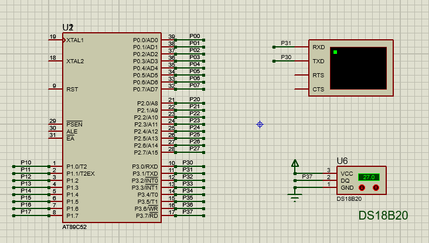

### 13_蜂鸣器实验

有源蜂鸣器实验，记得修改蜂鸣器的属性，我这里是改动好了的。

 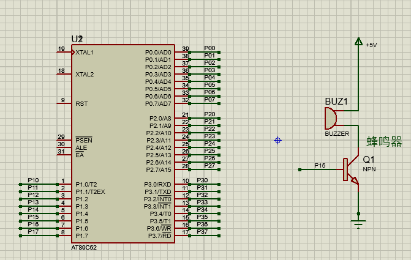

### 14_EEPROM实验

按键控制写入EEPROM的数据

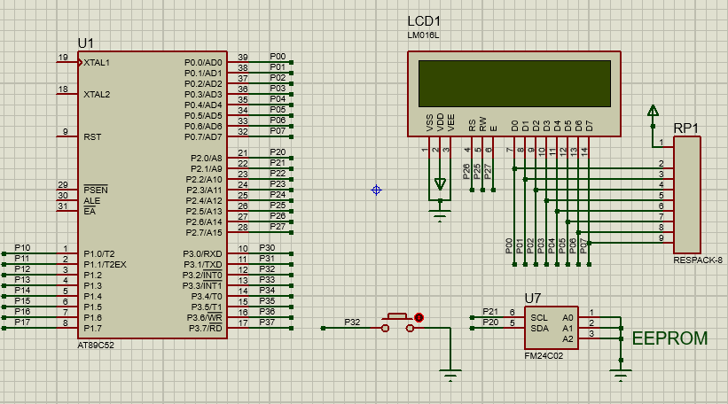

### 16_LED点阵实验

点阵的实现和数码管很相似。

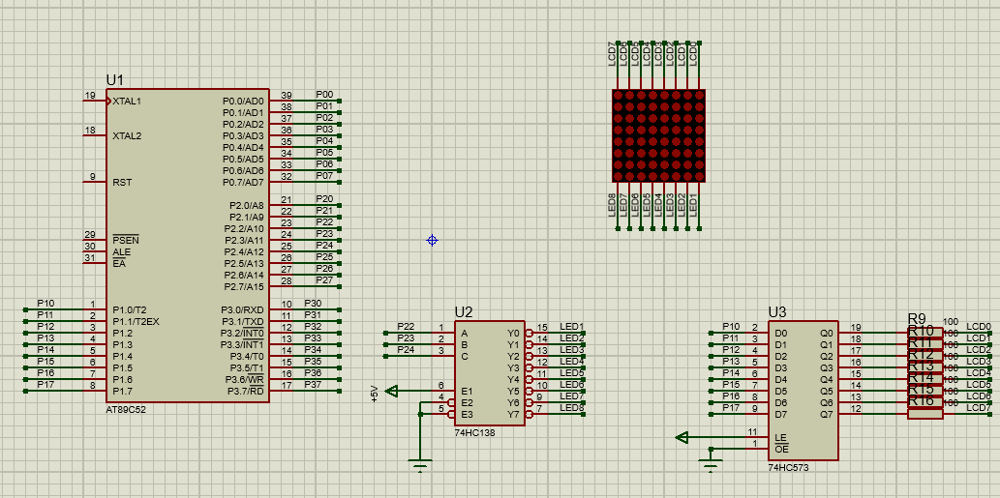

### 17_LCD12864显示模块

暂时没有写全。

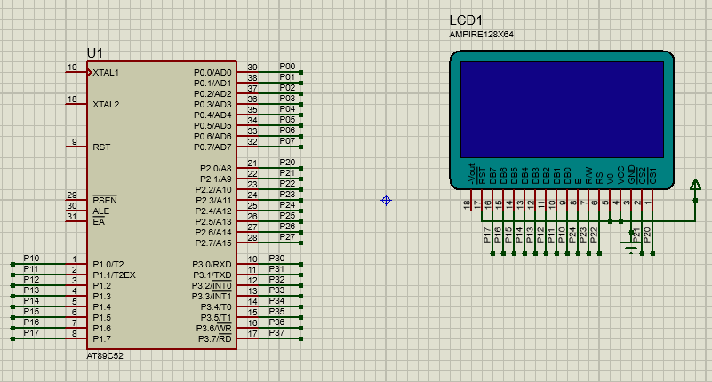

### 18_ADC0832

这个好像模块有点BUG

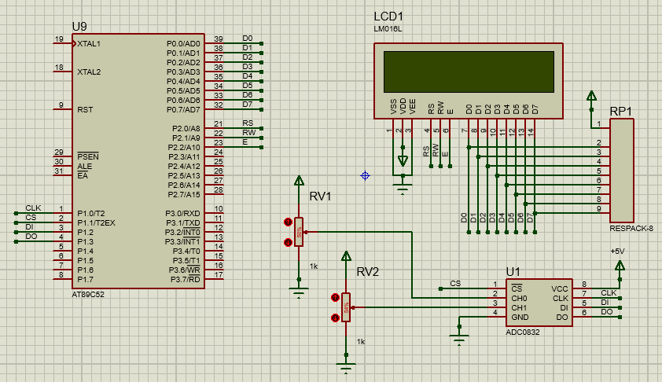             

## 未通过案例

### 15_自带EEPROM实验

这个不知道实物可不可以，仿真有点问题。

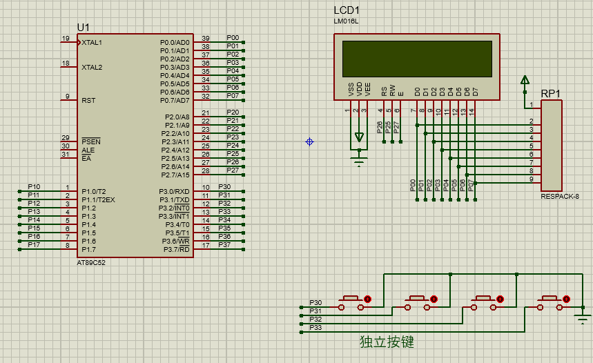
